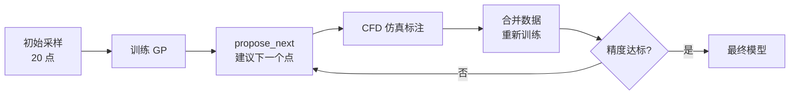

# 示例：主动学习采样

使用 `propose_next()` 循环智能选择采样点，以最小仿真次数达到目标精度。

## 完整代码

```python
import prandtl as pr
import numpy as np

# 1. 初始小批量采样（20 点）
X_init, Y_init = pr.sample(
    pr.analytical.cl_flat_plate,
    bounds=[(-5, 15), (0.01, 0.1)],
    n=20, method="lhs", seed=42
)

# 2. 初始 GP 训练
surrogate = pr.Surrogate(
    params=["alpha", "camber"],
    outputs=["CL"],
    method="gp"
).fit(X_init, Y_init)

# 3. 评估初始精度
X_test, Y_test = pr.sample(
    pr.analytical.cl_flat_plate,
    bounds=[(-5, 15), (0.01, 0.1)],
    n=100, method="lhs", seed=99
)
Y_pred_init = surrogate.predict(X_test)
init_report = pr.metrics({"CL": Y_test}, {"CL": Y_pred_init})
print(f"初始模型 — R²: {init_report['CL']['r2']:.4f}")

# 4. 主动学习循环（手动模式，每轮 1 个点）
X_all, Y_all = X_init.copy(), Y_init.copy()

for i in range(20):
    # propose_next：建议下一个采样点
    x_next = pr.propose_next(
        surrogate,
        bounds=[(-5, 15), (0.01, 0.1)],
        strategy="uncertainty",
        seed=i
    )

    # 模拟 CFD 仿真标注（实际场景中替换为真实求解器）
    _, y_new = pr.sample(
        pr.analytical.cl_flat_plate,
        bounds=[(-5, 15), (0.01, 0.1)],
        n=1, method="lhs"
    )
    y_true = 2 * np.pi * (np.radians(x_next[0]) + 2 * x_next[1])
    y_next = np.array([[y_true]])

    # 合并数据并重新训练
    X_all = np.vstack([X_all, x_next.reshape(1, -1)])
    Y_all = np.vstack([Y_all, y_next])
    surrogate.fit(X_all, Y_all)

    # 每 5 轮评估一次
    if (i + 1) % 5 == 0:
        Y_pred = surrogate.predict(X_test)
        report = pr.metrics({"CL": Y_test}, {"CL": Y_pred})
        print(f"迭代 {i+1} | 训练集: {len(X_all)} 点 | R²: {report['CL']['r2']:.4f}")

print(f"\n最终模型 — 从 20 → {len(X_all)} 点")
```

## 自动模式

```python
from prandtl import active_learn, Surrogate

def flat_plate(alpha, camber):
    """模拟 CFD 求解器"""
    cl = 2 * np.pi * (np.radians(alpha) + 2 * camber)
    return {"CL": cl}

surr = Surrogate(params=["alpha", "camber"], outputs=["CL"], method="gp")

X, Y, history = active_learn(
    flat_plate,
    bounds=[(-5, 15), (0.01, 0.1)],
    surrogate=surr,
    n_initial=10,
    n_iter=20,
    strategy="ei",
    verbose=True
)
```

## 工作流图示



## 关键要点

- **GP 后端必须**：`propose_next()` 依赖预测方差，仅 `method="gp"` 可用。
- **手动模式更灵活**：可以自定义终止条件、每轮评估、日志等。
- **自动模式更省事**：`active_learn()` 适合快速验证和基准测试。
- **实际 CFD 集成**：将 `y_true` 的计算替换为真实 CFD 求解器调用。
