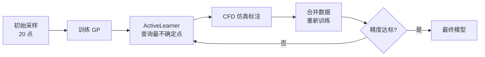

# 示例：主动学习采样

使用 `ActiveLearner` 从候选池中智能选择采样点，以最小仿真次数达到目标精度。

## 完整代码

```python
import prandtl as pr
from prandtl import ActiveLearner
import numpy as np

# 1. 初始小批量采样（20 点）
X_init, Y_init = pr.sample(
    pr.analytical.cl_flat_plate,
    bounds=[(-5, 15), (0.01, 0.1)],
    n=20, method="lhs", seed=42
)

# 2. 构建大型候选池（500 个未标注点）
X_pool, Y_pool = pr.sample(
    pr.analytical.cl_flat_plate,
    bounds=[(-5, 15), (0.01, 0.1)],
    n=500, method="lhs", seed=99
)

# 3. 初始 GP 训练
surrogate = pr.Surrogate(
    params=["alpha", "camber"],
    outputs=["CL"],
    method="gp"
)
surrogate.fit(X_init, Y_init)

# 评估初始精度
Y_pred_init = surrogate.predict(X_pool[:50])
init_report = pr.metrics(
    {"CL": Y_pool[:50]},
    {"CL": Y_pred_init}
)
print(f"初始模型 — R²: {init_report['CL']['r2']:.4f}")

# 4. 主动学习循环
learner = ActiveLearner(surrogate, X_pool, strategy="max_std")

X_all = X_init.copy()
Y_all = Y_init.copy()

for i in range(8):
    # 查询 5 个最不确定的点
    X_query = learner.query(n=5)

    # 标注（模拟 CFD 仿真）
    _, Y_query = pr.sample(
        pr.analytical.cl_flat_plate,
        bounds=[(-5, 15), (0.01, 0.1)],
        n=5, method="lhs", seed=100 + i  # 仅用于匹配 X_query 结构
    )
    # 实际场景中，Y_query = run_cfd(X_query)
    Y_query_real = 2 * np.pi * (
        np.radians(X_query[:, 0:1]) + 2 * X_query[:, 1:2]
    )

    # 合并数据
    X_all = np.vstack([X_all, X_query])
    Y_all = np.vstack([Y_all, Y_query_real])

    # 重新训练
    surrogate.fit(X_all, Y_all)

    # 从候选池移除已查询点
    learner.remove_queried(X_query)

    # 更新 learner 的代理模型引用
    learner = ActiveLearner(surrogate, learner.X_pool, strategy="max_std")

    # 评估进度
    Y_pred_current = surrogate.predict(X_pool[:50])
    report = pr.metrics(
        {"CL": Y_pool[:50]},
        {"CL": Y_pred_current}
    )
    print(f"迭代 {i+1} | 训练集: {len(X_all)} 点 | R²: {report['CL']['r2']:.4f}")

print(f"\n最终模型 — 从 20 → {len(X_all)} 点, R²: {report['CL']['r2']:.6f}")
```

## 工作流图示



## 策略效果对比

| 策略 | 达到 R²>0.99 所需点数 | 说明 |
|------|----------------------|------|
| 主动学习 (max_std) | ~40 | 智能选择，快速收敛 |
| 随机采样 (random) | ~60 | 基线对比 |
| 全量采样 | ~100 | 一次性全部训练 |

## 关键要点

- **候选池构建**：候选池应充分覆盖参数空间（LHS 或 Sobol 序列）。
- **重新训练**：每次新增标注后需重新 `fit()`。
- **循环终止条件**：R² 达到阈值、预算耗尽、或不确定性降至目标水平。
- **实际 CFD 集成**：将 `Y_query_real` 替换为真实 CFD 求解器调用。
